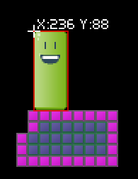
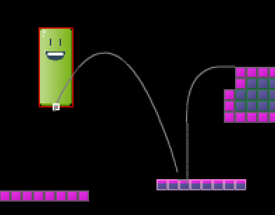

FlixelPlugins
========

A hopefully growing collection of plugins and experiments for HaxeFlixel.

## VisualDebug.hx

This plugin was created for the sole purpose of drawing debug information on the screen a lot easier. There are only a handful of basic types right now, but the number will grow should the need arise.

How to use:

    var x:Float = entity.getHitbox().x;
    var y:Float = entity.getHitbox().y;

    VisualDebug.drawCross(x + 20, y - 20, 4, -1, true);
    VisualDebug.drawLine(x, y, x - 20, y - 20, FlxColor.CYAN);
    VisualDebug.drawPoint(x - 20, y - 20, 4, FlxColor.RED);
    VisualDebug.drawRect(x + 40, y, 40, 20, -1, 0.5, "A Rectangle");
    VisualDebug.drawText(x + 40, y + 40, "1 up!");
    if (FlxRandom.chanceRoll(1))
    {
        VisualDebug.drawText(x + 40, y - 20, "Boo!", 0.5);
    }

### Misc examples

Every shape can be given an age so you could, for example, track the flight path of a shape.

	if (hb.x != hb.last.x || hb.y != hb.last.y)
	{
		VisualDebug.drawLine(hb.x, hb.y, hb.last.x, hb.last.y, FlxColor.GRAY, 2.0);
	}

You can use VisualDebug.hilight() to bring focus to individual FlxObjects.

	VisualDebug.hilight(hb);

## AbstractObjectGroup.hx

This is an experimental typed interface for FlxTypedGroup<FlxObject>. It behaves somewhat identical to FlxSpriteGroup, except it works with FlxObjects. It's designed for situations where you have an entity that consists of one hitbox and one or more sprites for graphic.

	var AOG:AbstractObjectGroup = AbstractObjectGroup.createNew();
	trace(AOG.hitbox);
	AOG.add(mySprite);
	AOG.hitbox.acceleration.y = 100;
	AOG.x = 50;
	AOG.y = 75;
	
	AOG.update();
	FlxG.collide(AOG.hitbox, myLevel);
	AOG.updatePositions();